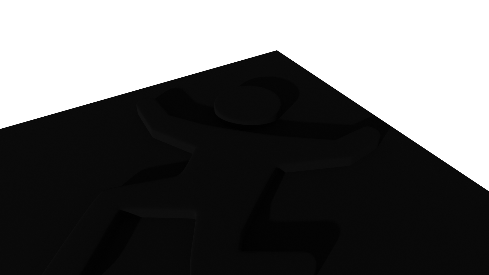

# blender-FallGuy

The Fall Guy Production Logo Animation

`FallGuy.blend`

## Previews...

## Rendered Animation...

## How to convert rendered animation images to a movie

* Render the animation to ./RenderResult/0001.png ...etc...
* Go there...
* Use ffmpeg to convert the PNGs to mp4
* BeAware: mp4 looses transparency of PNGs...

Example:

`ffmpeg -r 24 -i %04d.png -vcodec libx264 -crf 25 -pix_fmt yuv420p RenderResult.mp4`

* -r 24 -- FrameRate of InputFiles
* -i %04d.png -- InputFiles masked %04d (FourDigitsZeroPadded.png) in current dir
* -vcodec libx264 -- CodecLibrary
* -crf 25 -- Compression Quality
* -pix_fmt yuv420p -- ColorFormat
* RenderResult.mp4 -- OutputFileName in current dir

## Other helpful ffmpeg examples

### Convert to GIF

* Convert to gif (looses background transparency, thus mix in a desired background...)
* Scale down to x=320 y=KeepAspect (aka Follow)

`ffmpeg -loop 1 -i ../bg.png -r 24 -i %04d.png -filter_complex "overlay=0:0:shortest=1,scale=320:-1" RenderResult.gif`

* ...
* -loop 1 -i ../bg.png -- Loop over 1 frame of this input file...
* ...
* -filter_complex "overlay=0:0:shortest=1,scale=320:-1"
    * overlay=0:0:shortest=1 -- Overlay both inputs at x0:y0 and make clear which input is the shortest
    * scale=320:-1 -- ScaleDown to x320:yKeepAspect
* ...
